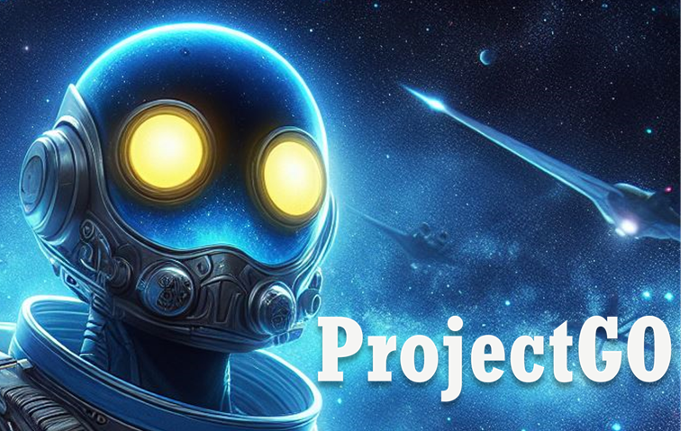
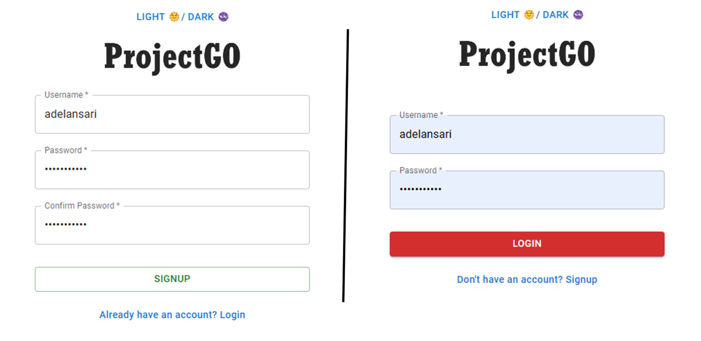
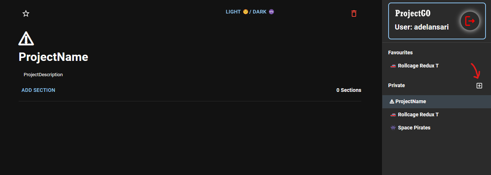
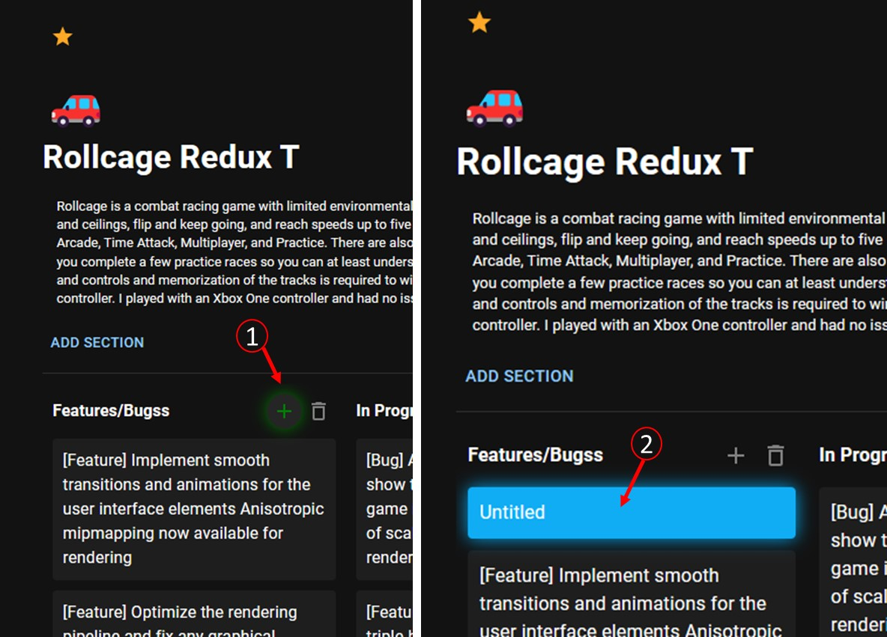
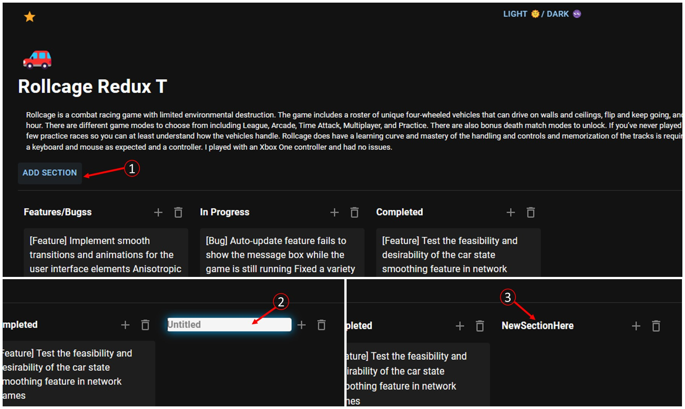
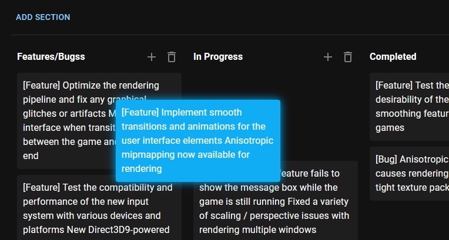

<div align="center">
<h2>◦ Project Management ◦</h2>
<h1 align="center">

<br>
</h1>

<h5 align="left">Front-End:</h5>
<p align="center">


</p>

<h5 align="left">Back-End and Other Tools:</h5>
<p align="center">


</p>
</div>

## Overview
This web-based application is designed for project management, featuring user authentication, board, section, and task management. It uses React for the frontend and Express.js with MongoDB for the backend.


#### Technologies Used
- Frontend: React, Redux, Material-UI
- Backend: Express.js, MongoDB
- Authentication: JWT

## Features
- **User Authentication**:
  - Register new users with encrypted password storage.
  - Login functionality with JWT token generation.
  - Token verification endpoint.
- **Task Management**:
  - Create, update, delete, and reposition (drag & drop) tasks.
  - Update the position of multiple tasks within or between sections.
- **Board Management**:
  - Create, retrieve, update, and delete boards.
  - Mark boards as favorites and update their positions.
- **Section Handling**:
  - Group tasks into sections for better organization. Manage tasks within sections.
  - Create, update, and delete sections within boards.
- **Animation and visuals <3**


### File Structure
#### Client-Side (React)

- **Main Entry**: `client/src/App.jsx` - Main application component.
- **Components**: `components/` - Reusable components.
  - Common Components: `EmojiPicker`, `FavouriteList`, `Kanban`, `Loading`, `Sidebar`, `TaskModal`.
  - Layout Components: `AppLayout`, `AuthLayout`.
- **Pages**:  `pages/` - redux Pages like Home, Board, Login, and Signup.
  - `Home.jsx` - The homepage of the application.
  - `Board.jsx` - For managing and viewing boards.
  - `Login.jsx` and `Signup.jsx` - Authentication pages.
- **Redux**: Centralized state and logic 
  - `boardSlice.js`, `favouriteSlice.js`, `userSlice.js` - Redux slices for state management.
  - `store.js` - The Redux store configuration.
- **API Calls**: `api/` - API calls for authentication, boards, sections, and tasks.
  - `authApi.js`, `boardApi.js`, `sectionApi.js`, `taskApi.js` - API services for handling HTTP requests.
- **Utilities**: `authUtils.js` - Utility functions related to authentication.
- **Assets and Styles**: Images and CSS files for customizing the appearance.

#### Server-Side (Node.js)

- **Main Entry**: `server/app.js`, `server/bin/www.js` - The starting point of the Node.js server.
- **Controllers**: `controllers/` -  Controllers for boards, sections, tasks, and users.
  - `board.js`, `section.js`, `task.js`, `uploadController.js`, `user.js` - Controllers for handling business logic.
- **Models**: `models/` -  Mongoose models for boards, sections, tasks, and users.
  - `board.js`, `section.js`, `task.js`, `user.js` - Mongoose models for database interactions.
- **Routes**: `routes/` -  Express routes for handling API requests.
  - `auth.js`, `board.js`, `section.js`, `task.js`, `upload.js` - Routes for handling API requests.
- **Middleware and Handlers**: `tokenHandler.js`, `validation.js` - Middleware for token handling and request validation.


#### Configuration and Documentation

- **Environment**: 
  - `.env.Example` - Template for environment variables.
- **Package Management**: 
  - `package.json` and `yarn.lock` files for dependency management.


## Getting Started

### Prerequisites
- Node.js
- npm or Yarn
- MongoDB

### Installation
1. **Clone the repository**
   ```bash
   git clone https://github.com/adelansari/project-management.git
   ```
2. **Install dependencies for the server**
   ```bash
   cd server
   yarn install
   ```
3. **Install dependencies for the client**
   ```bash
   cd ../client
   yarn install
   ```
4. **Set up environment variables**
   - Duplicate `server/.env.Example` and rename it to `.env`.
   - Fill in the necessary environment variables.
        ```bash
        # server/.env
        PORT=5000
        MONGODB_URL=mongodb://127.0.0.1:27017/project-management
        PASSWORD_SECRET_KEY=
        TOKEN_SECRET_KEY=
        ```

### Running the Application
1. **Start the server**
   ```bash
   cd server
   yarn start
   ```
2. **In a new terminal, start the client**
   ```bash
   cd client
   yarn start
   ```
3. The application should now be running on `localhost:3000`.

## Usage
- **Login/Signup**: Create an account or log in to access the dashboard.
  
- **Creating Boards/Projects**: Manage different projects or aspects of your work.
  
- **Adding Secion**: Add multiple section to manage different tasks and progress.
  
- **Adding Tasks**: Break down your work into manageable tasks.
  
- **Organizing Tasks**: Drag/Drop and group tasks for better clarity.
  

## Contributing
Contributions to the Project Management System are welcome! Please follow these steps:
1. Fork the repository.
2. Create a new branch (`git checkout -b feature/AmazingFeature`).
3. Commit your changes (`git commit -m 'Add some AmazingFeature'`).
4. Push to the branch (`git push origin feature/AmazingFeature`).
5. Open a pull request.

## License
Distributed under the MIT License. See `LICENSE` for more information.

---
